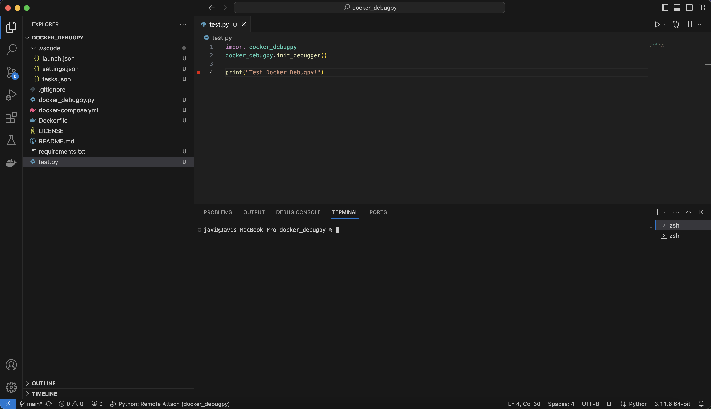
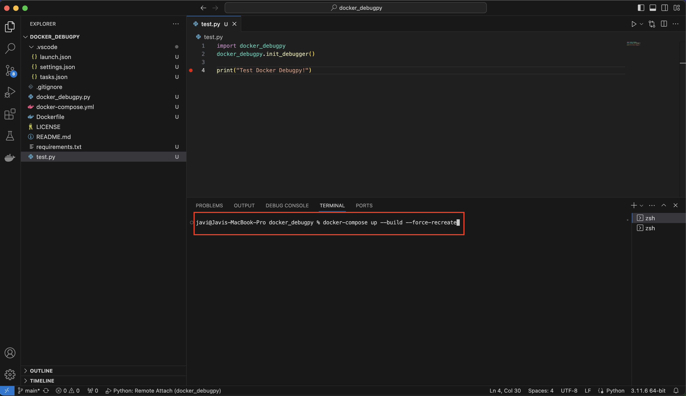
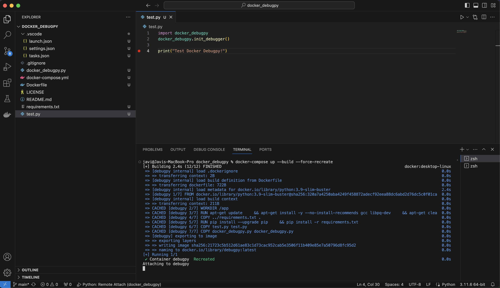
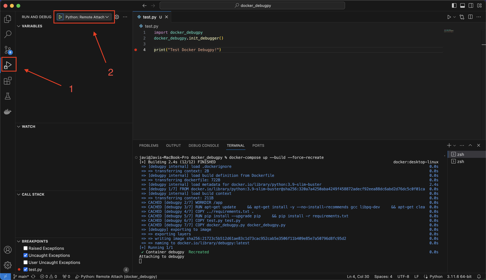
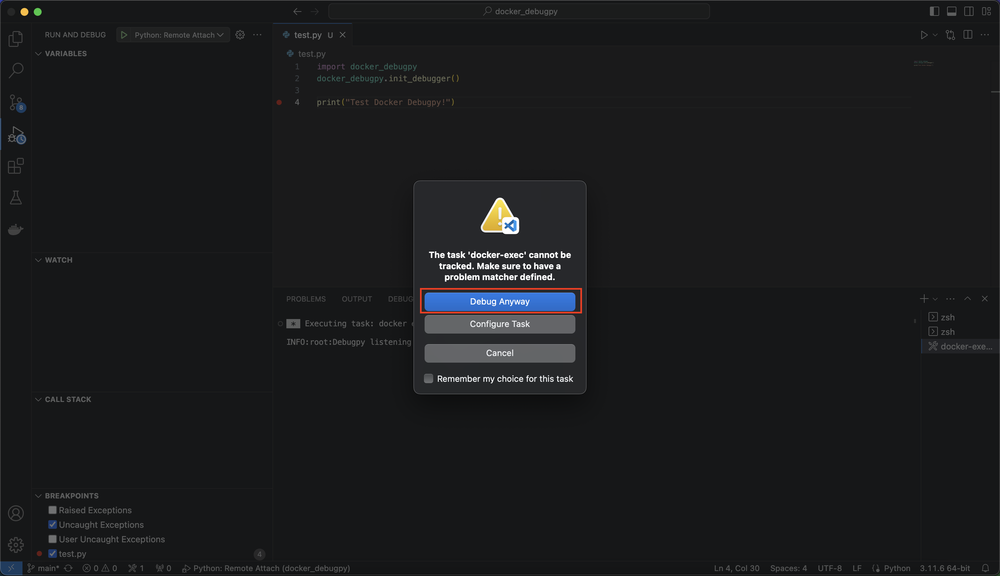
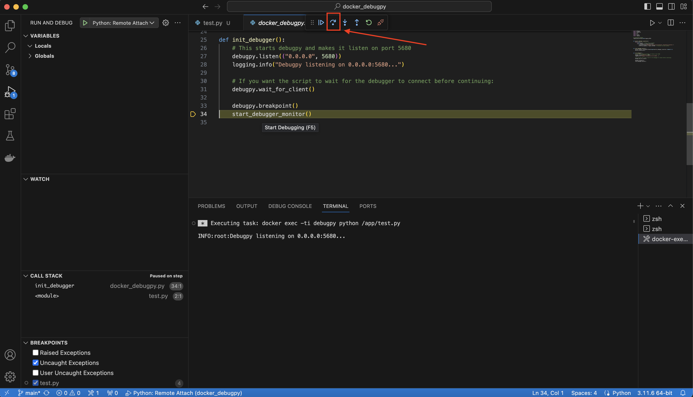
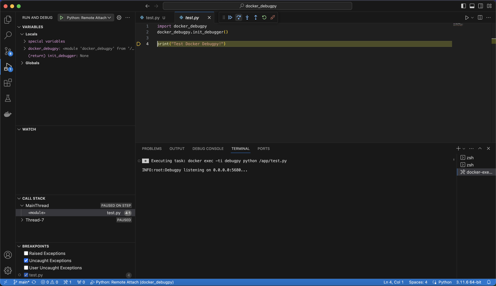
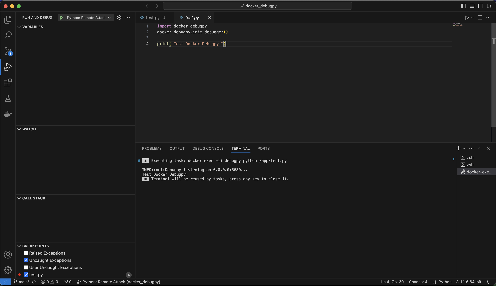

# docker_debugpy
A method to debug a python script in a docker container using VsCode

# Mandatory requirements
- Docker
- VSCode
- 10 minutes

# Follow the next steps
1. Open this project folder


2. Execute:
```docker-compose up --build --force-recreate```


3. Look that the docker container is up and running


4. Go to the `debug` section and in the `RUN AND DEBUG` section choose `Remote attach`


5. Clic on `Debug Anyway`


6. Continue debugging, by default the script docker_debugpy.py will be debugged:


7. Continue debugging:


8. And continue debugging:


Congrats! You are ready for use this method in your docker projects.